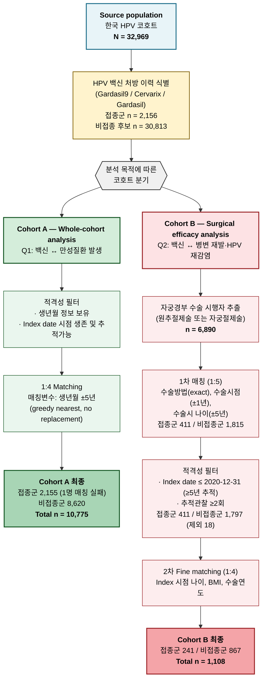

# Methods: Study Design and Cohort Selection

## 1. Study design overview

본 연구는 단일 의료기관 기반 한국 HPV 코호트(2009–2024년 등록)를 활용한 **후향적 매칭 코호트 연구**이다. HPV 백신 접종이 가지는 이중적 임상 가치 — (i) 다양한 만성질환 발생에 대한 광범위한 영향, (ii) 자궁경부 수술 환자에서의 병변 재발 예방 효과 — 를 단일 표본으로 검정하기 위해, 동일한 모집단으로부터 **연구 질문에 따라 두 개의 분석 코호트를 순차적으로 구축**하였다.

### 1.1 Research questions

| | Research question | 분석 코호트 |
|---|---|---|
| **Q1** | HPV 백신 접종은 자궁경부 외 주요 만성질환(심뇌혈관·대사질환) 발생과 연관되어 있는가? | **Cohort A** (전체 코호트 기반) |
| **Q2** | 자궁경부 상피내 병변으로 수술적 치료를 받은 환자에서 HPV 백신 접종은 병변 재발 및 새로운 고위험 HPV 감염을 줄이는가? | **Cohort B** (수술 환자 한정) |

> Q1을 먼저 평가함으로써 백신 접종군과 비접종군 간의 광범위한 임상적·인구학적 차이를 검토하고, 이어 Q2에서 수술 환자에 한정된 효능을 정밀하게 평가하는 **순차적·계층적 분석 전략**을 채택하였다.

---

## 2. Source population

| 항목 | 내용 |
|---|---|
| 자료원 | 한국 HPV 코호트 (단일 기관) |
| 등록기간 | 2009-01-01 – 2024-12-31 |
| 모집단 | 자궁경부 관련 진단·검사·수술 기록을 보유한 여성 |
| **n (전체)** | **32,969명** |
| 연결 가능한 도메인 | 진단정보, 진단검사(Lab), 처방정보, 수술처방, 병리검사, 기초임상정보(키·몸무게·혈압·흡연), 코호트 메타데이터(생년월·사망·추적종료) |
| 추적 종료일 | 2025-12-31 (또는 사망/자격상실일) |

진단정보 파일에는 5개 주요 만성질환에 대한 임상 분류 라벨이 포함되어 있다: (1) 협심증/심근경색, (2) 고혈압, (3) 당뇨, (4) 뇌출혈/뇌경색, (5) 폐색전증.

---

## 3. Exposure ascertainment

처방정보 데이터에서 다음 키워드로 HPV 백신 접종 환자를 식별하였다 — *Gardasil*, *Gardasil 9*, *Cervarix*, *HPV vaccine*, 가다실, 서바릭스. 각 환자의 **첫 접종일**을 노출 시작 시점(index date)으로 정의하였다. 처방 기록이 전혀 없는 환자는 비접종군으로 분류하였다.

- **접종군**: 2,156명 (6.5%)
  - Gardasil 9 (9가): 1,145 (53.1%)
  - Cervarix (2가): 690 (32.0%)
  - Gardasil (4가): 321 (14.9%)
- **비접종 후보군**: 30,813명 (93.5%)

---

## 4. Two analytic cohorts

전체 코호트(N = 32,969)로부터 연구 질문에 맞춰 다음 두 코호트를 도출하였다.

| | **Cohort A** (Whole-cohort) | **Cohort B** (Surgical) |
|---|---|---|
| 연구 질문 | Q1: 백신 ↔ 만성질환 발생 | Q2: 백신 ↔ 병변 재발·HPV 재감염 |
| 분석 모집단 | 전체 코호트 | 자궁경부 수술 시행자 (n = 6,890) |
| 매칭 비율 | 1:4 | 1:4 (1차 1:5 후 fine-matching) |
| 매칭 변수 | 생년월(±5년), index 시점 관찰가능성 | 수술방법(exact), 수술시점(±1년), 수술시 나이(±5세), Index 시점 나이, BMI, 수술연도 |
| Index date (접종군) | 첫 백신 접종일 | 첫 백신 접종일 |
| Index date (비접종군) | 매칭된 접종군의 백신일 (pseudo) | 비접종군 수술일 + 매칭된 접종군의 "수술-접종 간격(T)" |
| **최종 n** | **10,775** (접종 2,155 / 비접종 8,620) | **1,108** (접종 241 / 비접종 867) |
| Primary outcome | 5대 만성질환 발생 | 병변 재발 (HSIL/CIN3 이상), 새로운 고위험 HPV 감염 |

Cohort B는 Cohort A의 부분집합이며, 두 코호트는 **각각 독립적으로 매칭**되었다.

---

## 5. Cohort selection flow

**Figure 1.** Cohort selection flow diagram. 단일 모집단(N = 32,969)에서 연구 질문에 따라 Cohort A(전체 코호트, 만성질환 분석)와 Cohort B(수술 환자, 효능 분석)가 도출되었다.

---

## 6. Cohort A — Whole-cohort analysis

### 6.1 Rationale

전체 코호트를 활용하여 (a) 통계적 검정력을 최대화하고, (b) 자궁경부 수술이라는 특정 시술에 의존하지 않는 백신 접종 효과의 광범위한 신호 — 특히 안전성 측면의 만성질환 발생 — 를 평가한다.

### 6.2 Eligibility

- **포함**: 생년월 정보가 확보되고, 접종군의 첫 백신 접종일(또는 매칭에 따른 pseudo index date) 시점에 생존하며 추적 가능한 환자
- **제외**: 생년월 결측, Index date 시점 사망 또는 추적 종료

### 6.3 Matching procedure

- **매칭 변수**: 생년월 ±5년
- **알고리즘**: Greedy nearest matching, without replacement (random seed = 42)
- **매칭 비율**: 1:4
- **Index date 부여**:
  - 접종군: 첫 백신 접종일
  - 비접종군: 매칭된 접종군의 첫 백신 접종일을 pseudo index date로 부여

### 6.4 Cohort A characteristics (post-matching)

| 변수 | 접종군 (n=2,155) | 비접종군 (n=8,620) | \|SMD\| |
|---|---|---|---|
| Age at index, years (mean ± SD) | 33.48 ± 9.15 | 34.16 ± 9.22 | 0.074 |
| Birth year (mean ± SD) | 1982.31 ± 10.08 | 1981.64 ± 10.07 | 0.067 |
| Index year (mean ± SD) | 2015.74 ± 4.11 | 2015.74 ± 4.11 | 0.000 |
| Follow-up days (mean ± SD) | 2,135 ± 1,733 | 2,320 ± 1,567 | 0.112 |
| Female (%) | 100.0 | 100.0 | 0.015 |
| Mortality during follow-up (%) | 0.3 | 0.4 | 0.022 |

매칭 변수(나이·생년월)에서 \|SMD\| < 0.10으로 양호한 균형이 확인되었다.

---

## 7. Cohort B — Surgical efficacy analysis

### 7.1 Rationale

연구 계획서의 main analysis로, ASCUS/LSIL → HSIL/CIN3 이상으로 진행하여 수술적 치료(원추절제술 또는 자궁절제술)를 받은 환자에서 백신 접종이 병변 재발과 새로운 고위험 HPV 감염을 줄이는지 평가한다. 임상적으로 동질한 수술 환자에 한정함으로써 indication confounding을 줄이고 수술 방법·BMI 등 자궁경부 질환 특이적 변수를 매칭에 반영할 수 있다.

### 7.2 Eligibility

- **포함**: 자궁경부 수술 시행자(n = 6,890), Index date ≤ 2020-12-31 (≥5년 추적 확보 목적), 추적관찰 기록 2회 이상
- **제외**: Index date 이전 재발, Index date 시점 사망/자격상실, 2020년 이후 백신 접종 완료, 매칭 실패

### 7.3 Matching procedure (2단계)

**Step 1 — Initial matching (1:5)**
- 매칭 변수: 수술방법 (원추절제술/자궁절제술, exact), 수술시점 (calendar year ±1년), 수술시 나이 (±5년)
- 결과: 접종군 411 / 비접종군 1,815

**Step 2 — Index date 부여 및 적격성 필터링**
- 접종군: 첫 백신 접종일
- 비접종군: 비접종군 수술일 + 매칭된 접종군의 "수술-접종 간격(T)" → pseudo index date
- Index date ≤ 2020-12-31 및 추적 ≥2회 충족 여부 확인 → 18명 제외 (접종군 411 / 비접종군 1,797)

**Step 3 — Fine matching (1:4)**
- 추가 매칭 변수: Index date 시점 나이, Index date에 가장 가까운 BMI, 수술연도
- **최종**: 접종군 241 / 비접종군 867 (총 1,108명)

### 7.4 Cohort B characteristics (post-matching)

| 변수 | 접종군 (n=241) | 비접종군 (n=867) |
|---|---|---|
| Age at index, years (mean) | 37.26 | 37.17 |
| BMI, kg/m² (mean) | 22.34 | 22.28 |
| Surgery year (mean) | 2016.18 | 2016.27 |
| Follow-up days (mean) | 2,234 | 2,236 |
| 원추절제술 (%) | ~99 | ~99 |

---

## 8. Statistical analysis (요약)

각 코호트에 대해 다음 분석을 수행한다 (자세한 분석 계획은 별도 문서 참조).

| 분석 | Cohort A | Cohort B |
|---|---|---|
| Baseline 비교 | 매칭 변수 SMD, 인구학·기저질환 | 매칭 변수 SMD (Love plot) |
| 발생률 비교 | Fisher's exact (5대 만성질환, baseline·신규발생) | n (%) 발생률 |
| Time-to-event | (해당 없음) | Kaplan-Meier, log-rank |
| 다변량 모형 | Cox PH (보정: 잔여 불균형 변수) | Cox PH (연령 보정), HR (95% CI) |
| Subgroup | 연령군 | 연령군, 백신 종류 (Gardasil9/Cervarix/Gardasil) |
| 민감도 | 추적기간 제한 | 추적기간 제한, As-treated, Adjusted vs Unadjusted |

---

## 9. Reproducibility

| 항목 | 값 |
|---|---|
| Random seed | 42 (numpy) |
| 매칭 알고리즘 | Greedy nearest matching, without replacement |
| Cohort A 빌드 스크립트 | `scripts/comorbidity_matched_full.py` |
| Cohort B 빌드 스크립트 | `scripts/build_matched_cohort.py` → `scripts/build_final_cohort.py` |
| 백신 식별 키워드 | Gardasil, Cervarix, HPV vaccine, 가다실, 서바릭스 |
| 인코딩 | 원본 CP949, 가공 UTF-8-SIG |
| 산출물 | `Data/full_cohort_age_matched.csv` (Cohort A), `Data/final_matched_cohort.csv` (Cohort B) |
| 분석 일자 | 2026-04-29 |
